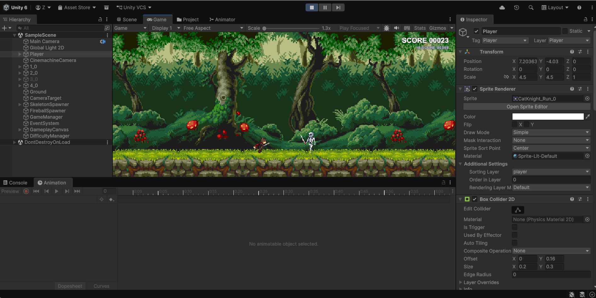

# 🐾 Pawbound — 2D Endless Runner

A 2D endless-runner game developed with **Unity and C#**, inspired by classic side-scrolling runner games.

Pawbound combines player movement, jumping, obstacle avoidance, score progression, and a continuously scrolling environment into an engaging endless gameplay loop.

---

## 📸 Gameplay



---

## 🎮 Game Overview

The player controls a character running through a continuously scrolling 2D environment.

> **Run as far as possible, avoid obstacles, and achieve the highest score.**

The game becomes progressively more challenging as the player survives longer.

### Core Gameplay Loop

```text
START
  ↓
Character Runs
  ↓
Obstacles Appear
  ↓
Jump / Avoid
  ↓
Score Increases
  ↓
Difficulty Increases
  ↓
Continue Running
  ↓
Collision → GAME OVER
  ↓
RESTART
````

---

## ✨ Key Features

### 🏃 Player

* Responsive 2D movement
* Automatic forward movement
* Jump mechanics
* Sprite-based animations

### 🌄 Environment

* Continuously scrolling environment
* Multi-layer parallax background
* Different scrolling speeds for depth

### 🪨 Obstacles & Collision

* Dynamic obstacles
* Physics-based collision detection
* Game-over state on collision

### 📈 Scoring & Difficulty

* Score progression based on survival
* Increasing gameplay difficulty
* Endless high-score focused gameplay

---

## 🛠️ Technologies

| Technology           | Purpose                         |
| -------------------- | ------------------------------- |
| **Unity 6.3 LTS**    | Game engine                     |
| **C#**               | Gameplay and system programming |
| **Unity 2D**         | 2D game development             |
| **Physics 2D**       | Movement and collision          |
| **Sprite Animation** | Character animation             |
| **Cinemachine**      | Camera tracking                 |
| **Git & GitHub**     | Version control                 |

---

## 🧩 Core Systems

```text
Pawbound
│
├── Player System
│   ├── Movement
│   ├── Jump
│   └── Animation
│
├── Environment
│   ├── Scrolling
│   └── Parallax
│
├── Obstacle System
│   ├── Spawning
│   └── Collision
│
├── Score System
│   └── Difficulty Progression
│
└── Game State
    ├── Playing
    ├── Game Over
    └── Restart
```

---

## 🎯 Development Focus

This project explores practical **2D game development and gameplay programming**, including:

* C# scripting
* Player movement and physics
* Sprite animation
* Collision detection
* Parallax scrolling
* Camera systems
* Obstacle management
* Score and difficulty progression
* Game-state management

---

## 🚀 Project Structure

```text
Unity-Pawbound-2D-Adventure/
│
├── Assets/
├── Packages/
├── ProjectSettings/
├── public/
│   └── picture.png
│
├── .gitignore
└── README.md
```

---

## 🎮 Controls

| Input                | Action  |
| -------------------- | ------- |
| **Space / Up Arrow** | Jump    |
| **R**                | Restart |

---
